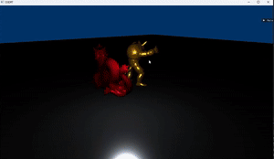
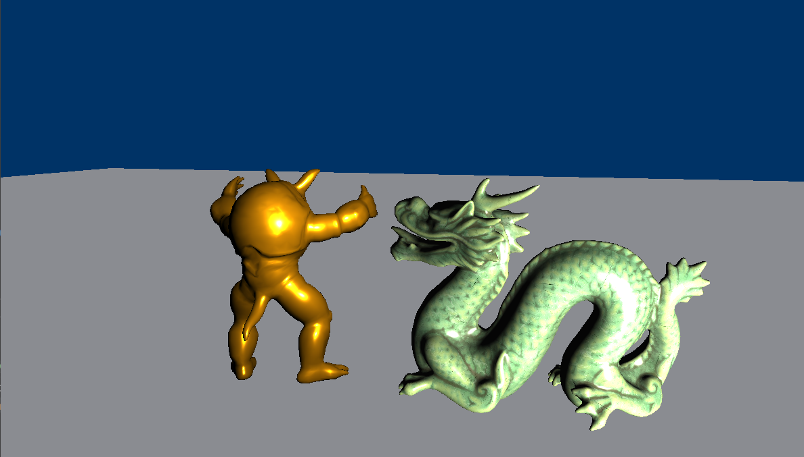
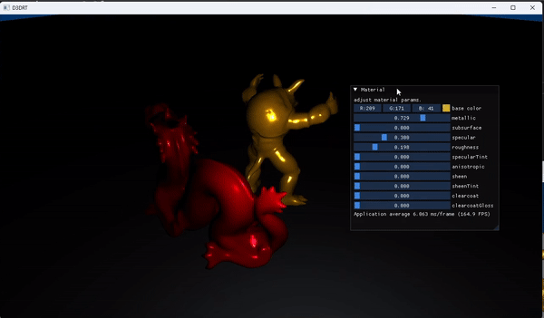
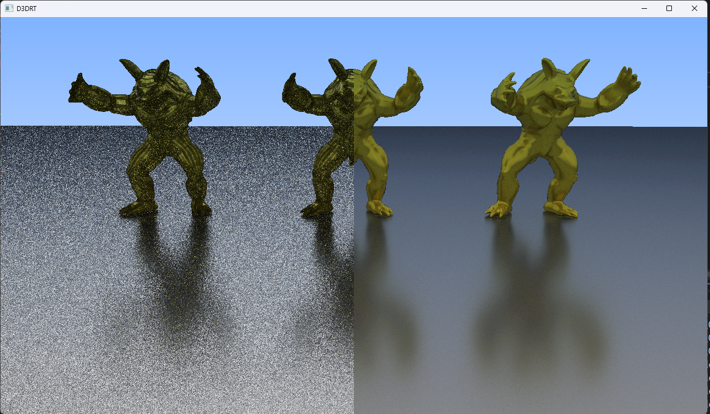
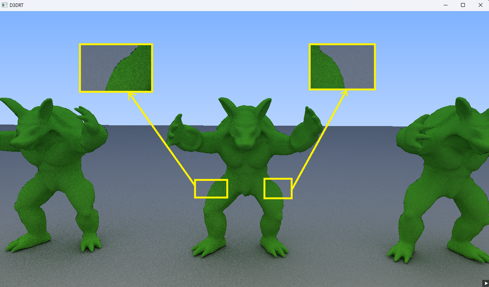

# D3DRT
A lite code Rasteration and Ray Tracing Renderer, Implemented by DirectX12 and DXR pipeline.

## Usage

```
git clone --recurse-submodules https://github.com/Edenlia/D3DRT.git
```

open D3DRT.sln and build

## Features

**Implement rasteration and raytracing pipelines and can switch render mode in runtime.**




**Implement multiple materials (Blinn-Phong and Disney Principled) in rasteration mode.**




**imgui change material parameters in runtime**




**Important sampling for Disney principled BRDF**

Uniform sampling(left), Important sampling(right), using 500ssp: 




**Low Discrepancy Sequence for denoise**

Pseudorandom number(left), Sobol sequence number(right), using 20ssp: 



## Reference

https://developer.nvidia.com/rtx/raytracing/dxr/DX12-Raytracing-tutorial-Part-1

https://github.com/microsoft/DirectX-Graphics-Samples

https://github.com/AKGWSB/EzRT
